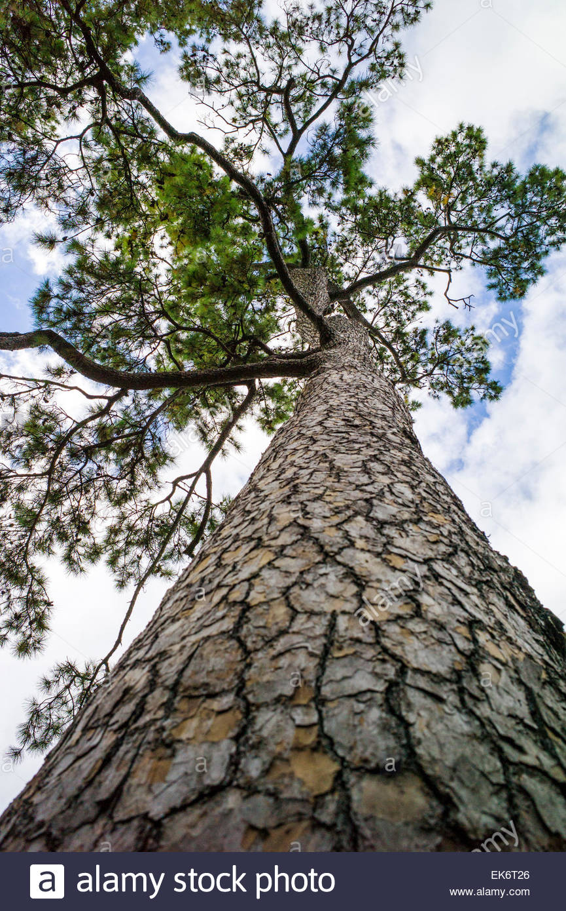

```{r setup, include=FALSE}
knitr::opts_chunk$set(echo = FALSE)
```

## Problems, Problems

Are you tired of look at your Loblolly Pine and not knowing it's age? Well stress no further, the Loblolly Pine Tree App is here.




## How to Use the App

Using the App is very simple. All you need to do is measure the height of your Loblolly Pine Tree. (Okay, so maybe this is not that simple...I'll tackle that in the next app)


## What The App Does

The App fits two different models, one with just a plain-old LSLR with age as the outcome and height as the predictor. The second model raises the age to the 1/2 power in an attempt to make the data more linear.

Depending on the history of your tree, you can decide which model to use. Both models are displayed with a line of best fit as well as a sliding point that matches your height input.


- model1 <- lm(age~height, data=tree)
- model2 <- lm(I(age^.5)~height, data=tree)


## What's the Magic of Model 2?

You might be wondering - "How in the world does this fantastic model do it?" Well, in the output command of the server.R file for Model 2, the resulting value is squared to counter the raising to the 1/2 power of the model. The result is an age that you can interpret.

  output$pred2 <- renderText({
    model2pred()^2
    })


Have fun figuring out the ages of all your Loblolly Pine Trees!

