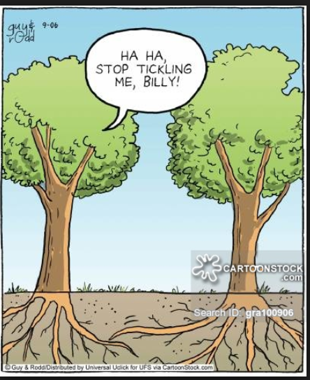

```{r setup, include=FALSE}
knitr::opts_chunk$set(echo = TRUE)
```

## Meet the Loblolly Pine Tree


## Loblolly Pine Trees

This graph shows the height of 84 Loblolly Pine Trees as they age. The color represents the seed number. 

```{r, echo=FALSE, message=FALSE, warning=FALSE}
library(ggplot2)
library(plotly)
data("Loblolly")
tree <- Loblolly
#head(tree)
plot_ly(tree, x=tree$age, y=tree$height, mode="markers", color=tree$Seed)


```

## This concludes my fantastic slide show about Loblloly Pine Trees


